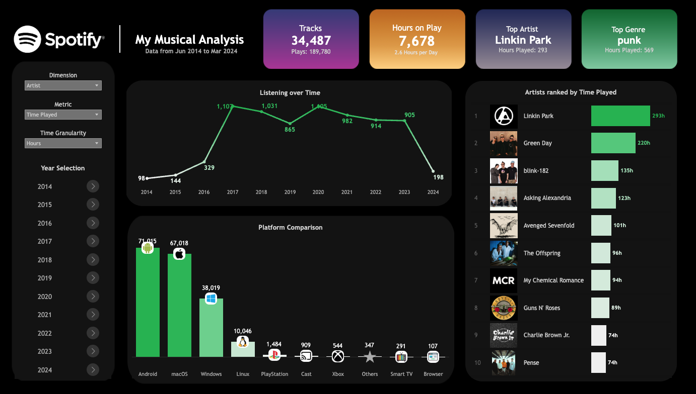

<a id="readme-top"></a>

<!-- PROJECT LOGO -->
<br />
<div align="center">
  <a href="https://github.com/github_username/repo_name">
    
  </a>

<h3 align="center">My Musical Analysis - Spotify</h3>

  <p align="center">
    Analysing my own musical taste through the last decade (2014 to 2024) based on Spotify's user data. 
</div>


<!-- TABLE OF CONTENTS -->
<details>
  <summary>Table of Contents</summary>
  <ol>
    <li>
      <a href="#about-the-project">About The Project</a>
      <ul>
        <li><a href="#built-with">Built With</a></li>
        <li><a href="#prerequisites">Prerequisites</a></li>
      </ul>
    </li>
    <li><a href="#usage">Usage</a></li>
    <li><a href="#contact">Contact</a></li>
  </ol>
</details>


<!-- ABOUT THE PROJECT -->
## About The Project

[](https://public.tableau.com/views/MySpotifyAnalysis_17393181873530/MySpotifyAnalysis?:language=en-US&:sid=&:redirect=auth&:display_count=n&:origin=viz_share_link)


**You can access the dashboard available in [Tableau Public here](https://public.tableau.com/views/MySpotifyAnalysis_17393181873530/MySpotifyAnalysis?:language=en-US&:sid=&:redirect=auth&:display_count=n&:origin=viz_share_link).**

The **main objective** of this project is to exercise my own data analysis skills in a personal project. As a music lover and heavy Spotify user (more than 10 years), I found in Spotify's user historical data ([tutorial here](https://www.quora.com/How-can-I-download-my-Spotify-data)) a motivation to see how my musical taste changed in a decade (it actually did not that much).

<p align="right">(<a href="#readme-top">back to top</a>)</p>

### Built With

* 
* 
* 
* 


<p align="right">(<a href="#readme-top">back to top</a>)</p>

### Prerequisites

These are the used libraries on this project, so they are mandatory to run it:

```
spotipy==2.23.0
pandas==2.1.3
```

In the case of `spotipy`, you can check the [docs here](https://spotipy.readthedocs.io/en/2.25.0/#getting-started) on how to set up the Spotify's OAuth credentials - mandatory for accessing its API and retrieving additional information, like the artist's genre and image, as well as other data that is not available on user's history.

However, retrieving data from [Spotify's API](https://developer.spotify.com/documentation/web-api) is optional, as you can simply analyze the available data on the history, without further enrichment as I did.

<p align="right">(<a href="#readme-top">back to top</a>)</p>

<!-- USAGE EXAMPLES -->
## Usage

This project was divided in four steps:
1. Downloading the files from my own [Spotify's user account](https://www.quora.com/How-can-I-download-my-Spotify-data) (it can take weeks to receive it, depending on your history size).
2. Compressing all CSV files into just one using the script [dataset_consolidation.py](dataset_consolidation.py) - your data will come separated into multiple CSVs, depending on its size. In my case, it was 12 audio files + 1 video file.
3. Adding extra columns on the dataset using Spotify API (with the library `spotipy`), like the artist genre and profile picture with the script [track_enriching.ipynb](track_data_enriching.ipynb).
4. With the consolidated CSV in hands, I built all the visualizations on [Tableau](https://www.tableau.com/) and published it on [Tableau Public](https://public.tableau.com/views/MySpotifyAnalysis_17393181873530/MySpotifyAnalysis?:language=en-US&:sid=&:redirect=auth&:display_count=n&:origin=viz_share_link)

So, if you want to reproduce it in your own data, just follow these steps above (3 and 4 are optional).

<p align="right">(<a href="#readme-top">back to top</a>)</p>

<!-- CONTACT -->
## Contact

Lucas Leal

[](https://www.linkedin.com/in/lucaslealdasilva/)


Project Link: 
[spotify-musical-analysis](https://github.com/casluleal/spotify-musical-analysis)

<p align="right">(<a href="#readme-top">back to top</a>)</p>

